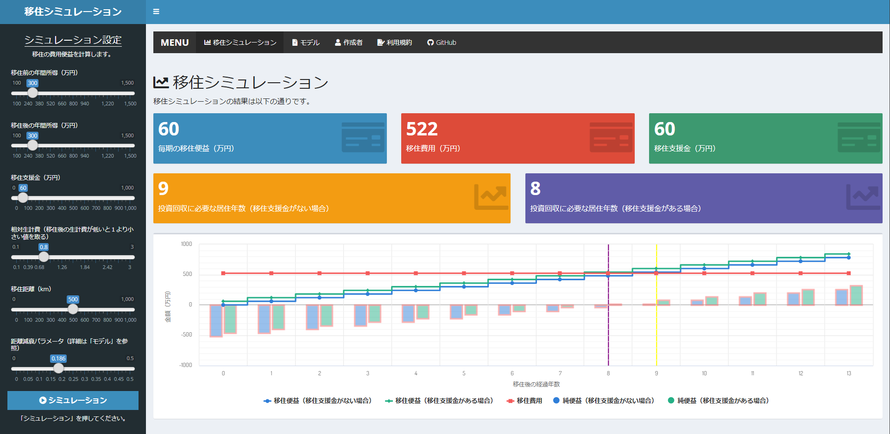

# 移住シミュレーション

## Shinyウェブアプリケーション
本研究では、地方創生における移住支援金政策を事前評価するための簡易的な分析枠組みを提案しています。移住支援金の金額をどのように決めたらいいのか、現在の金額でどれほどの政策効果があるのかについて、政策を実施する前から具体的な数値に基づいて議論できるように研究を行っています。  
URL: https://keisuke-kondo.shinyapps.io/migration-simulator-jp/

## 利用規約
当サイトで公開している情報（以下「コンテンツ」）は、どなたでも自由に利用できます。コンテンツ利用に当たっては、本利用規約に同意したものとみなします。本利用規約の内容は、必要に応じて事前の予告なしに変更されることがありますので、必ず最新の利用規約の内容をご確認ください。

### 著作権
本コンテンツの著作権は、近藤恵介に帰属します。

### 第3者の著作権
本コンテンツには、第三者が著作権又は著作権以外の権利を有しているものが含まれている場合があります。本コンテンツを利用する際は、第三者の権利を侵害しないようにしてください。

### 免責事項
<ul>
<li>作成にあたり細心の注意を払っていますが、本サイトの内容の完全性・正確性・有用性等についていかなる保証を行うものでありません。</li>
<li>本サイトを利用したことによるすべての障害・損害・不具合等、作成者および作成者の所属するいかなる団体・組織とも、一切の責任を負いません。</li>
<li>本サイトは、事前の予告なく変更、移転、削除等が行われることがあります。</li>
</ul>

## 作成者
近藤恵介  
独立行政法人経済産業研究所、上席研究員  
神戸大学経済経営研究所、准教授  
Email: kondo-keisuke@rieti.go.jp  
URL: https://keisukekondokk.github.io/  

## 参考文献
近藤恵介 (2019) 「東京一極集中と地方への移住促進」、RIETI Policy Discussion Paper No. 19-P-006（2022年11月改訂）  
URL: https://www.rieti.go.jp/jp/publications/summary/19040007.html  

## 履歴
2022年10月28日　Shinyウェブアプリ公開
